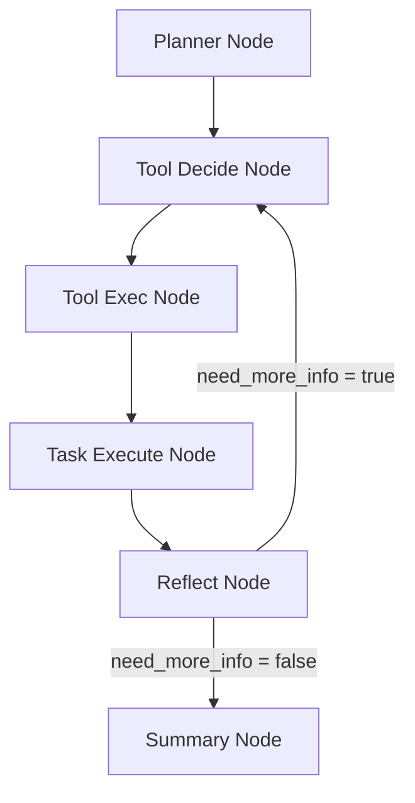
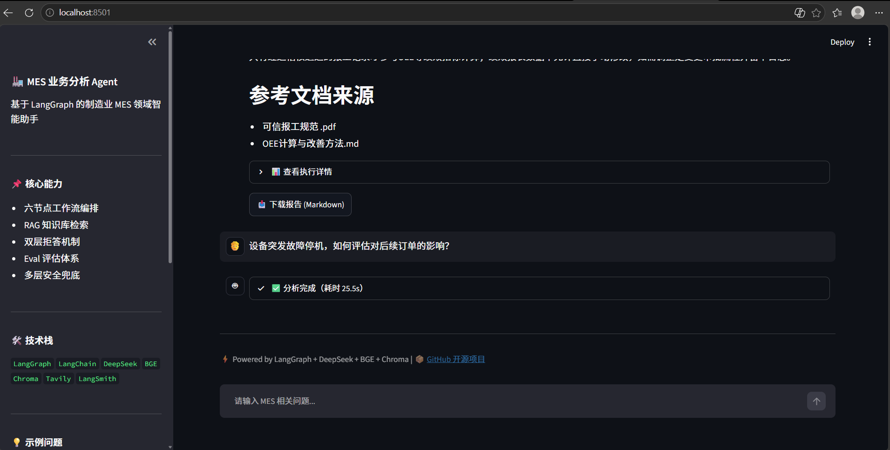
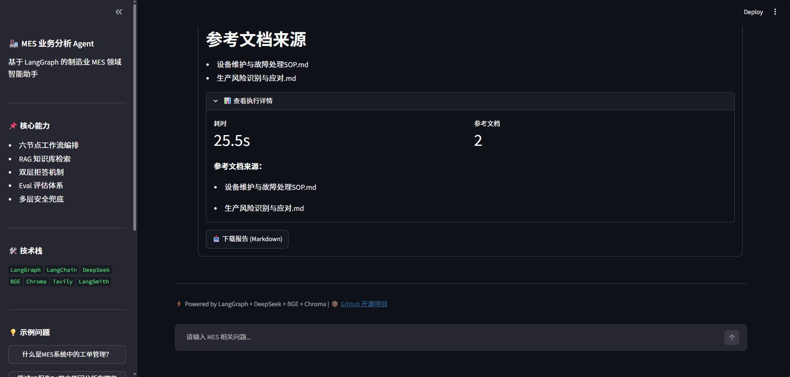
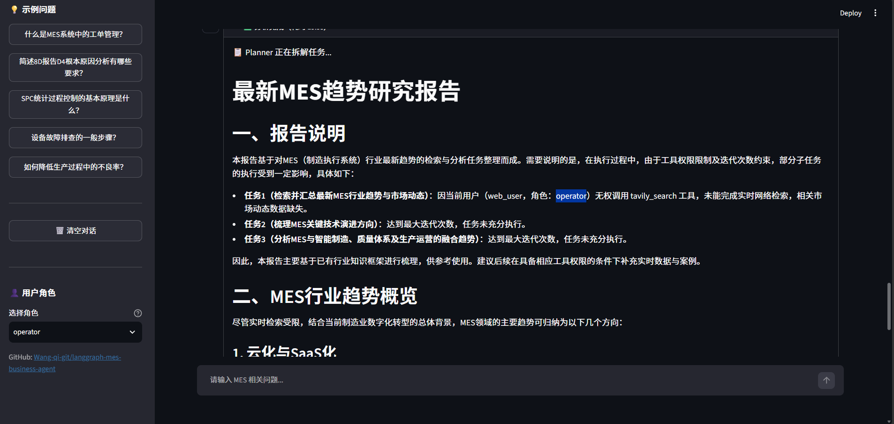
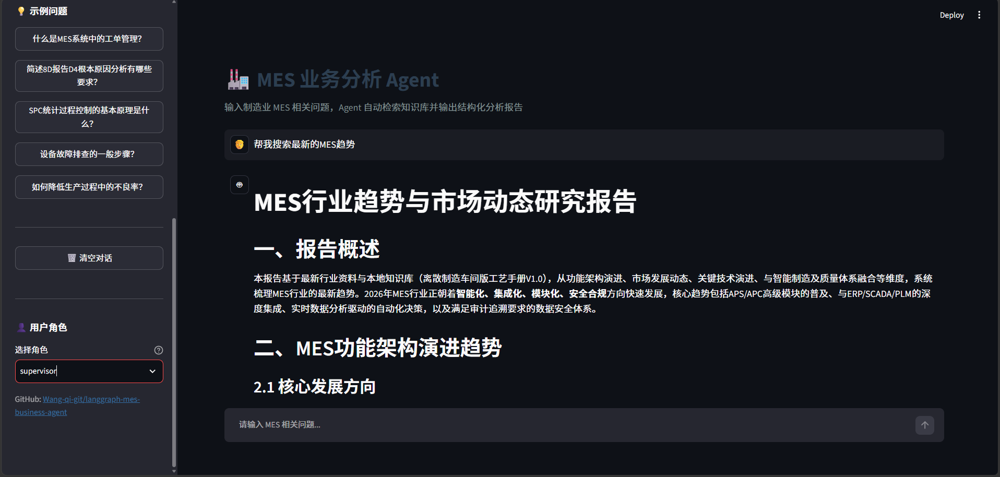
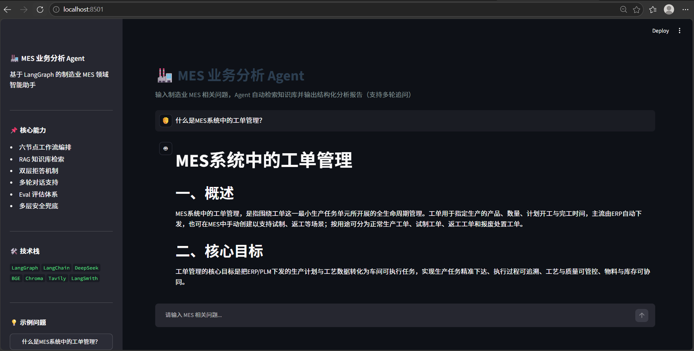

# MES 业务分析 Agent

> 一个基于 LangGraph 的制造业 MES 领域智能助手，支持多节点工作流、RAG 检索、反思重规划、双层拒答机制、权限控制、多轮对话、Web 交互界面和 FastAPI 服务。


---

## 🌐 在线体验

👉 部署中，稍后更新链接

也可本地运行：

```bash
streamlit run app.py
```

浏览器打开 http://localhost:8501

---

## 一、项目背景与目标

制造业 MES（制造执行系统）业务人员日常需要查询大量规范文档：8D 报告规范、SPC 控制、工艺手册、报工规范、BOM 管理规则等。传统做法依赖关键词检索或人工翻阅，效率低、容易遗漏。

本项目构建了一个 MES 领域业务分析 Agent，可以：

- 理解用户自然语言提问，自动拆解为子任务
- 通过本地 RAG 知识库检索相关规范文档
- 结合 Reflection 机制动态评估答案质量并重规划
- 对非 MES 领域问题主动拒答
- 支持角色权限控制（操作工 / 班组长 / 管理员）
- 提供多轮对话、Web 界面、REST API 三种交互方式

---

## 二、系统架构

### 2.1 六节点工作流



### 2.2 核心状态（AgentState）

| 字段 | 类型 | 说明 |
|------|------|------|
| user_query | str | 用户原始问题 |
| case_id | str | 评测用例编号 |
| user_id | str | 用户 ID |
| user_role | str | 用户角色（operator/supervisor/admin） |
| task_list | list | 子任务列表 |
| context_local_kb | str | 本地知识库检索结果 |
| context_from_web | str | Web 检索结果 |
| think_trace | list | 思考链 |
| ref_docs | list | 参考文档来源 |
| loop_count | int | 循环次数（上限 3） |

---

## 三、核心功能

- **自然语言问答**：用中文提问，Agent 自动理解意图
- **任务拆解与规划**：Planner 把复杂问题拆成 2-4 个子任务
- **RAG 知识库检索**：基于 BGE + Chroma 检索本地 MES 规范文档
- **联网搜索（HITL）**：本地知识不足时，人工确认后联网补充
- **反思重规划**：Reflect 节点评估答案质量，不达标自动重跑
- **双层拒答**：非 MES 问题直接拒答，Token 消耗降低 95%
- **权限控制**：不同角色能用的工具不同，权限不足时优雅降级
- **审计日志**：所有查询和权限拒绝都有结构化记录
- **多轮对话**：支持追问，Agent 记得上下文
- **Web 交互界面**：基于 Streamlit，支持对话、详情查看、报告下载
- **REST API**：基于 FastAPI，可集成到其他系统
- **Eval 评估体系**：20 个测试用例，LLM-as-Judge 双维度评分

---

## 四、核心技术设计

### 4.1 双层拒答机制

第一层（Planner）：Prompt 约束 LLM 判断问题是否属于 MES 领域。不属于就输出 REJECT 标记。

第二层（Task Execute）：检测到 REJECT 前缀，直接返回固定话术，不调 LLM。

效果：拒答用例 Token 从 15000 降至 780（↓95%），耗时从 30s 降至 3s。

### 4.2 Reflection 收敛判断

- 分支 A：达到最大循环且任务全完成 → 直接出报告
- 分支 B：达到最大循环仍有 pending → 强制收尾
- 分支 D：其他情况 → 正常反思调 LLM

效果：大部分用例从 4 轮降至 2-3 轮，Token 成本降低约 30%。

### 4.3 权限控制与审计日志

**角色矩阵**：

| 角色 | 权限 |
|------|------|
| operator（操作工） | 只能查本地知识库 |
| supervisor（班组长） | 本地知识库 + 联网搜索 |
| admin（管理员） | 全权限 |

**实现方式**：
- 在 AgentState 中传递 user_role
- 在 tool_exec_node 调用工具前校验权限
- 权限不足时拒绝执行，并把任务标记为 completed（避免死循环）
- 所有权限拒绝和查询完成都写入 audit.log

**审计日志字段**：用户 ID、角色、操作类型、状态、查询内容、参考文档、时间戳。

### 4.4 多轮对话

**实现方式**：Streamlit 层维护最近对话历史，只在"需要上下文"时拼接。

**判断逻辑**：
- 含指代词（它 / 这个 / 上述）且问题较短 → 拼历史
- 含追问词（详细说说 / 展开 / 继续）且问题较短 → 拼历史
- 其他情况 → 不拼历史，避免 Token 浪费

**效果**：大多数独立问题不拼历史，Token 消耗几乎不变。

### 4.5 安全与兜底机制

| 层级 | 机制 |
|------|------|
| L1 | 最大循环上限（loop_count ≥ 3 强制收敛） |
| L2 | HITL 联网确认 |
| L3 | 空查询跳过 |
| L4 | LLM 异常降级 |
| L5 | JSON 解析兜底 |
| L6 | 上下文截断 |

---

## 五、Eval 评估体系

### 5.1 测试集设计

20 个用例覆盖 5 类场景：

- 简单查询 5 个
- 复杂推理 5 个
- 多工具协作 4 个
- 边界拒答 3 个
- 对抗测试 3 个

### 5.2 双 Judge 评估器

Judge 1：LLM-as-Judge 答案质量评分（业务正确性 / 完整性 / 结构化）

Judge 2：RAG 召回相关性评分（0-1 分）

---

## 六、实验与优化

### 6.1 版本迭代对比


| 版本 | 优化内容 | answer AVG | rag AVG |
|------|----------|------------|---------|
| V1 | 初始版本 | 0.80 | 0.38 |
| V2 | + 双层拒答机制 | 0.93 | 0.38 |
| V3 | + metadata 修复 + 知识库扩充 | 0.92 | 0.61 |

关键发现：

- V2 的答案质量跃升 +0.13，主要来自拒答用例处理
- V3 的 RAG 召回跃升 +0.23，来自 metadata 修复 + 知识库扩充

### 6.2 Trace 执行链路


### 6.3 Streamlit Web 界面





### 6.4 权限控制效果





### 6.5 多轮对话



### 6.6 失败案例分析：case_004 BOM 版本 V99

现象：Agent 输出 7000+ 字分析报告，未明确说明"V99 不存在"，answer 仅 0.40。

Trace 定位：第 1-3 轮 task_execute 输出均在 500+ tokens，Agent 一直在"分析如何判断 BOM 版本有效性"，从未识别出"这个版本不存在"。

修复尝试：加"对象不存在直接拒答"规则后，5 用例 case_004 从 0.53 涨到 0.87，但 20 用例平均分从 0.90 掉到 0.70。

最终决策：回退规则，接受 case_004 的短板，保住整体稳定性。

反思：5 个用例能验证方向对不对，只有全量才能验证改得稳不稳。

### 6.7 CHROMA_TOP_K 对比实验

| TOP_K | 平均 answer | 平均 rag |
|-------|------------|---------|
| 3 | 0.93 | 0.50 |
| 5 | 0.91 | 0.45 |

结论：知识库规模较小时（< 50 chunk），TOP_K=5 会引入噪声，反而降低答案质量。

---

## 七、技术栈

| 层 | 技术 |
|----|------|
| 工作流编排 | LangGraph 1.4 |
| LLM | DeepSeek-Chat |
| 嵌入模型 | BAAI/bge-small-zh-v1.5 |
| 向量库 | Chroma |
| Web 检索 | Tavily |
| Web 界面 | Streamlit |
| REST API | FastAPI + Uvicorn |
| 容器化 | Docker |
| 可观测性 | LangSmith |
| PDF 解析 | PyPDFLoader |
| Markdown 解析 | TextLoader |

成本意识：

- 拒答短路：省 95% Token
- 过滤模式：迭代阶段省 70% 成本
- Reflection 收敛：省 30% Token

---

## 八、快速开始

### 8.1 环境准备

```bash
pip install -r requirements.txt
```

.env 文件配置：

```
DEEPSEEK_API_KEY=your_key
TAVILY_API_KEY=your_key
LANGSMITH_API_KEY=your_key
```

### 8.2 构建知识库

```bash
python build_kb.py
```

### 8.3 三种运行方式

**方式一：命令行运行**

```bash
python graph_agent_skeleton.py
```

**方式二：Web 界面（推荐）**

```bash
streamlit run app.py
```

浏览器打开 http://localhost:8501

**方式三：REST API**

```bash
uvicorn api:api --host 0.0.0.0 --port 8000
```

访问 http://localhost:8000/docs 查看接口文档。

**方式四：Docker 部署**

```bash
docker build -t mes-agent:latest .
docker run -p 8000:8000 --env-file .env mes-agent:latest
```

### 8.4 批量评估

```bash
python eval_agent.py
```

### 8.5 目录结构

```
langgraph-mes-business-agent/
├── graph_agent_skeleton.py    # Agent 主程序
├── app.py                     # Streamlit Web 界面
├── api.py                     # FastAPI 服务
├── Dockerfile                 # Docker 部署
├── eval_agent.py              # 批量评估脚本
├── build_kb.py                # 知识库构建脚本
├── pdf_docs/                  # PDF 规范文档
├── md_docs/                   # Markdown 规范文档
├── screenshots/               # 项目截图
├── docs/                      # 输出示例
├── .streamlit/                # Streamlit 配置
├── audit.log                  # 审计日志（运行时生成）
└── README.md
```

---

## 九、后续规划

- 引入 Rerank 进一步提升 RAG 召回质量
- 支持多会话隔离（基于 thread_id）
- 对接真实 MES API 接口
- 增加 Prometheus 监控指标
- 扩充知识库至 50+ 份文档

---

## 十、面试要点

如果面试官问"这个项目最难的地方是什么"，可以这样回答：

> "最难的不是写工作流，而是判断什么时候该停止优化。比如 case_004 的短板，我试过用 Prompt 规则修复，5 个用例测试涨了 0.34 分，但跑全量 20 个用例时发现规则被过度泛化，导致 8 个正常用例退化，整体从 0.90 掉到 0.70。最终我选择回退，接受这个短板。这让我理解到——5 个用例能验证方向对不对，但只有全量才能验证改得稳不稳。"

---

## 十一、License

MIT