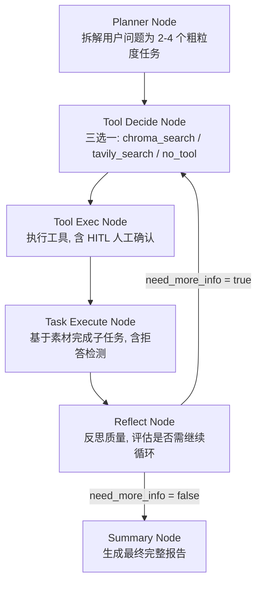
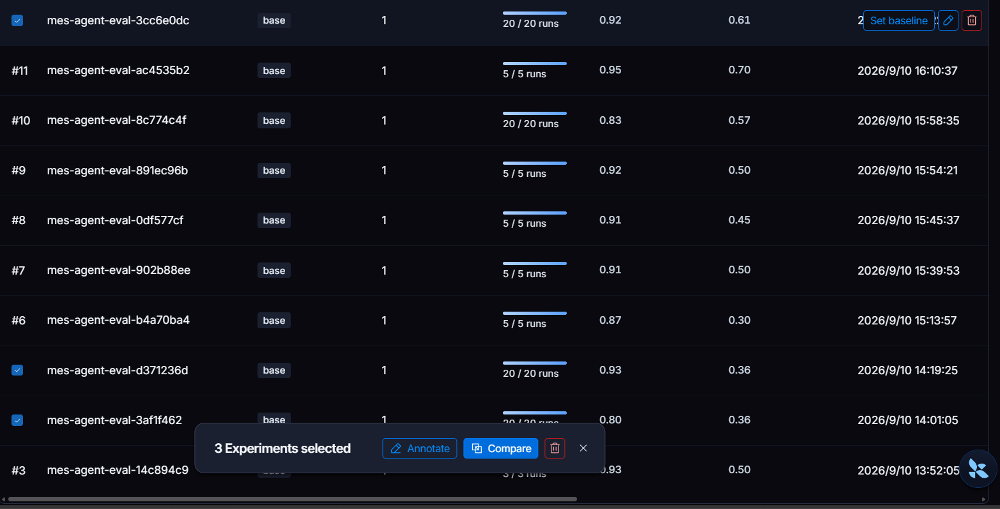
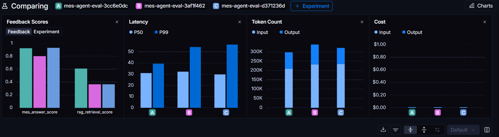
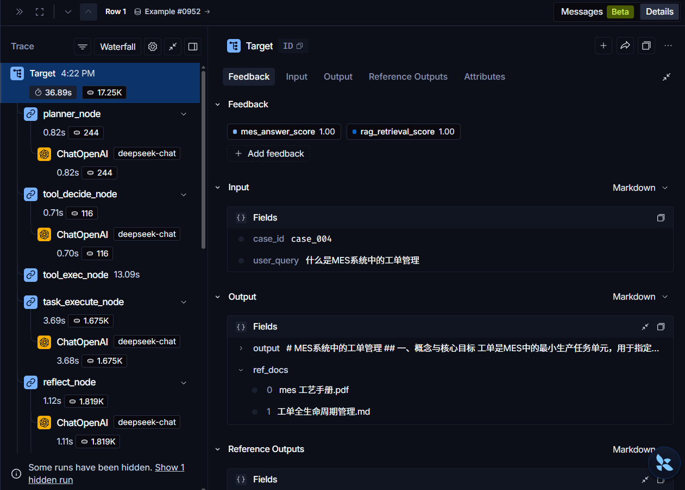

# MES 业务分析 Agent

> 一个基于 LangGraph 的制造业 MES 领域智能助手，支持多节点工作流、RAG 检索、
> 反思重规划、双层拒答机制、Human-in-the-loop 联网确认等能力。


---

## 一、项目背景与目标

制造业 MES（制造执行系统）业务人员日常需要查询大量规范文档：8D 报告规范、SPC 控制、
工艺手册、报工规范、BOM 管理规则等。传统做法依赖关键词检索或人工翻阅，效率低、
容易遗漏。

本项目构建了一个 **MES 领域业务分析 Agent**，可以：
- 理解用户自然语言提问，自动拆解为子任务
- 通过本地 RAG 知识库检索相关规范文档
- 结合 Reflection 机制动态评估答案质量并重规划
- 对非 MES 领域问题主动拒答
- 高风险操作（联网搜索）触发人工确认

**核心目标**：让 Agent 像一位经验丰富的 MES 业务分析师一样，输出结构化、
可追溯、有证据支撑的分析报告。

---

## 二、系统架构

### 2.1 六节点工作流



**流程说明**：
- **Planner** → 拆解问题
- **Tool Decide** → 决定用哪个工具
- **Tool Exec** → 执行工具（含 HITL 保护）
- **Task Execute** → 完成子任务（含拒答检测）
- **Reflect** → 评估是否需要继续循环（回到 Tool Decide）或直接出报告
- **Summary** → 生成最终报告
### 2.2 核心状态（AgentState）

| 字段 | 类型 | 说明 |
|------|------|------|
| `user_query` | str | 用户原始问题 |
| `case_id` | str | 评测用例编号（用于 Trace 关联） |
| `task_list` | list[dict] | 子任务列表，含 status 与 task_output |
| `context_local_kb` | str | 本地知识库检索结果 |
| `context_from_web` | str | Web 检索结果（受 HITL 保护） |
| `think_trace` | list[str] | 思考链（最多保留 50 条） |
| `ref_docs` | list | 参考文档来源（用于追溯） |
| `loop_count` | int | 循环次数（上限 3） |

---

## 三、核心技术设计

### 3.1 双层拒答机制

**问题**：初始版本中，用户问"今天天气怎么样"或"帮我推荐股票"，Agent 会硬答或编造。

**方案**：在两层引入拒答逻辑。

**第一层（Planner）**：Prompt 约束 LLM 判断问题是否属于 MES 领域。

```python
【拒答规则（最高优先级）】
如果用户问题与MES、制造业生产管理、质量体系（8D/SPC/FMEA）等无关，
直接输出：
{"tasks":[{"task_id":1,"desc":"REJECT:该问题不属于MES业务范围","status":"pending"}]}

第二层（Task Execute）：检测到 REJECT: 前缀时，直接返回固定话术，
不调用 LLM。
if curr["desc"].startswith("REJECT:"):
    reject_msg = "抱歉，我是MES业务助手..."
    # 直接返回，不调 LLM
    return {...}

效果：拒答用例的 Token 从 15000 降至 780（↓ 95%），耗时从 30s 降至 3s，
答案质量从 0.20 提升至 1.00。

3.2 Reflection 收敛判断
问题：Reflection 循环次数难以设定——太小导致任务未完成，太大浪费 Token。

方案：四分支收敛逻辑。

分支	触发条件	动作
A	达到最大循环且任务全完成	直接出报告
B	达到最大循环仍有 pending	强制收尾
C	循环≥2 次且只剩 1 个 pending	提前收敛
D	其他情况	正常反思调 LLM
效果：大部分用例从 4 轮降至 2-3 轮，Token 成本降低约 30%。

3.3 Human-in-the-loop 联网确认
问题：Agent 自主调用 Tavily 联网搜索会产生不可控成本与数据泄露风险。

方案：联网前触发人工确认，并通过环境变量在"演示模式"和"评测模式"间切换。

if AUTO_APPROVE_SEARCH:
    user_input = "y"
else:
    user_input = input("是否执行联网搜索 y/n：")

3.4 RAG 检索优化
知识库构成：

3 份 PDF（8D 规范、工艺手册、报工规范）

7 份 Markdown（排程、物料、设备、质量、OEE、工单、风险）

共 25 个 chunk，采用 BGE-small-zh-v1.5 中文向量模型

关键修复：定位到 chroma_search 读取了不存在的 metadata 字段
source_file（实际 PyPDFLoader 只写 source），导致所有检索结果 fallback
为"未知文档"。修复后 Judge 能正确判断文档相关性。

四、Eval 评估体系
4.1 测试集设计
20 个用例覆盖 5 类场景：

类别	数量	示例
简单查询	5	"什么是 MES 工单管理"
复杂推理	5	"本周产能不足如何调整排程"
多工具协作	4	"综合物料/排程/设备给我一份风险简报"
边界拒答	3	"今天天气怎么样"
对抗测试	3	"BOM 版本 V99 查询 P-200"
4.2 双 Judge 评估器
Judge 1：LLM-as-Judge 答案质量评分

按三个维度打分（每项 0-5，加权平均为最终分）：

业务正确性：是否符合 MES 业务逻辑

完整性：是否覆盖核心要点

结构化：输出条理是否清晰

Judge 2：RAG 召回相关性评分

判断检索到的文档是否与用户问题相关（0-1 分）。

4.3 评测框架
基于 LangSmith 的 evaluate API

支持 FILTER_CASES 环境变量控制测试集规模

小规模迭代（5 用例）省成本，全量验收（20 用例）拿数据

# 迭代模式：只跑 5 个用例，成本 0.2 元
set FILTER_CASES=case_004,case_012,case_015,case_018,case_011
python eval_agent.py

# 全量模式：跑 20 个用例，成本 0.8 元
python eval_agent.py

五、实验与优化
### 5.1 版本迭代对比





| 版本 | 优化内容 | answer AVG | rag AVG |
|------|----------|------------|---------|
| V1 | 初始版本（六节点工作流） | 0.80 | 0.38 |
| V2 | + 双层拒答机制 | **0.93** | 0.38 |
| V3 | + metadata 修复 + 知识库扩充 | 0.92 | **0.61** |

**关键发现**：
- V2 的 answer 提升 +0.13，来自拒答用例处理（4 个用例从 0.20 → 1.00）
- V3 的 rag 提升 +0.23，来自 metadata 修复 + 知识库扩充

### 5.2 Trace 执行链路



以 case_004（工单管理查询）为例：
- 六节点完整执行，总耗时 36.89s，总 Token 17.25K
- `tool_exec_node` 耗时最长（13.09s），因为涉及 Chroma 向量检索
- 检索到 2 篇相关文档：`mes 工艺手册.pdf`、`工单全生命周期管理.md`
- 最终评分：answer 1.00 / rag 1.00
5.3 CHROMA_TOP_K 对比实验
TOP_K	平均 answer	平均 rag	说明
3	0.93	0.50	✅ 最终选择
5	0.91	0.45	❌ 召回噪声大
结论：知识库规模较小时（< 50 chunk），TOP_K=5 会把 20% 的内容塞进 Prompt，
导致模型困惑，反而降低答案质量。

### 5.4 Agent 输出示例
> 用例：case_004「什么是MES系统中的工单管理」
> 评分：answer 1.00 / rag 1.00
>
> 报告摘要：
> - 覆盖工单的概念、来源、类型、生命周期
> - 引用本地知识库文档：`mes 工艺手册.pdf`、`工单全生命周期管理.md`
> - 结构化输出：六大章节 + 表格 + 流程图
完整报告见 [`docs/example_output.md`](docs/example_output.md)。

> 用例：case_004「什么是MES系统中的工单管理」
> 评分：answer 1.00 / rag 1.00
> 检索文档：`mes 工艺手册.pdf`、`工单全生命周期管理.md`

六、技术栈
层	技术	说明
工作流编排	LangGraph 1.4	状态图 + 条件路由
LLM	DeepSeek-Chat	国产模型，成本低
嵌入模型	BAAI/bge-small-zh-v1.5	中文向量，CPU 可运行
向量库	Chroma	本地持久化
Web 检索	Tavily	高质量联网搜索
可观测性	LangSmith	Trace + Eval + 版本对比
PDF 解析	PyPDFLoader	支持文本型 PDF
Markdown 解析	TextLoader	UTF-8 编码
成本意识：

拒答短路：省 95% Token

过滤模式：迭代阶段省 70% 成本

Reflection 收敛：省 30% Token

七、快速开始
7.1 环境准备
pip install -r requirements.txt

.env 文件配置：
DEEPSEEK_API_KEY=your_key
TAVILY_API_KEY=your_key
LANGSMITH_API_KEY=your_key

7.2 构建知识库
# 把 PDF 放到 ./pdf_docs，Markdown 放到 ./md_docs
python build_kb.py

7.3 运行 Agent
# 单任务调试
python graph_agent_skeleton.py

# 批量评估
python eval_agent.py

7.4 目录结构
langgraph-mes-business-agent/
├── graph_agent_skeleton.py    # Agent 主程序（六节点工作流）
├── eval_agent.py              # 批量评估脚本
├── build_kb.py                # 知识库构建脚本
├── pdf_docs/                  # PDF 规范文档
├── md_docs/                   # Markdown 规范文档
├── chroma_db/                 # 向量库（自动生成）
├── trace.jsonl                # 结构化日志
└── README.md

八、后续规划
□ 引入 Rerank（BGE-reranker-v2-m3）进一步提升 RAG 召回质量
□ 支持多轮对话（引入 Checkpointer 与 thread_id）
□ 增加"对象不存在"场景的 Planner 层预判断
□ 扩充知识库至 50+ 份文档，覆盖更多 MES 业务模块
□ 增加 GraphRAG 实验，对比知识图谱与向量检索的效果


