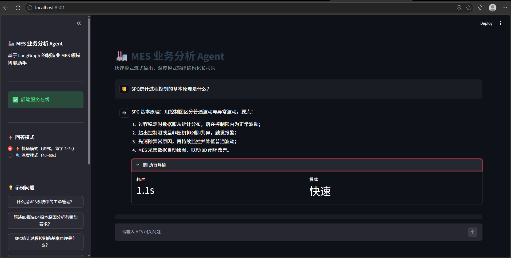
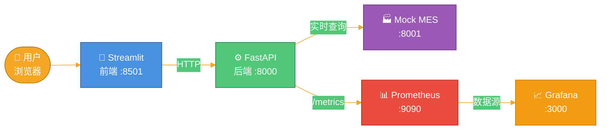
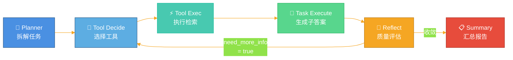
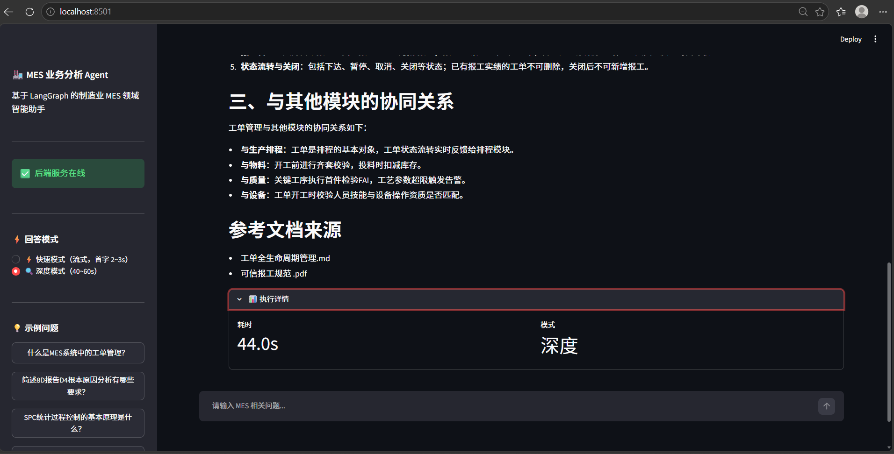
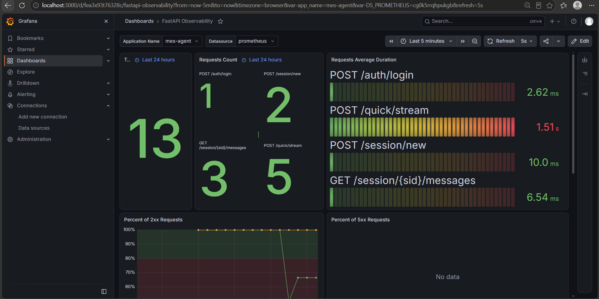
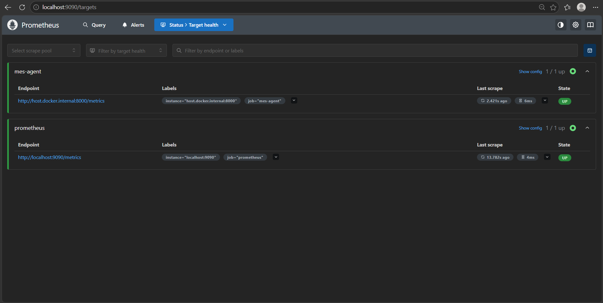
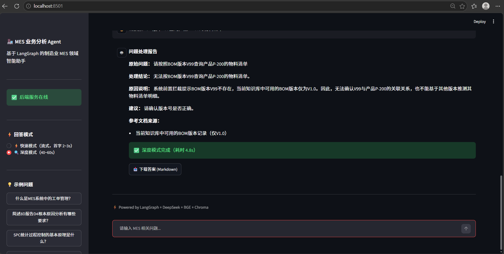
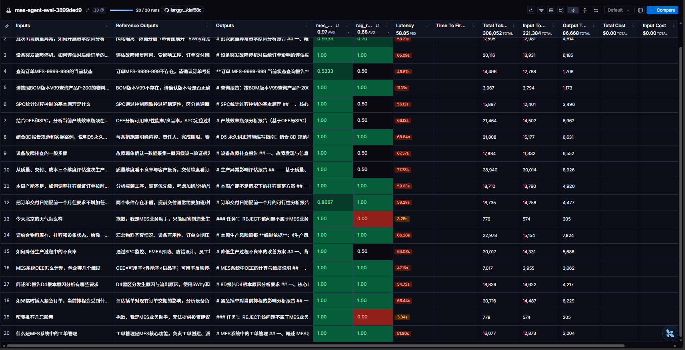
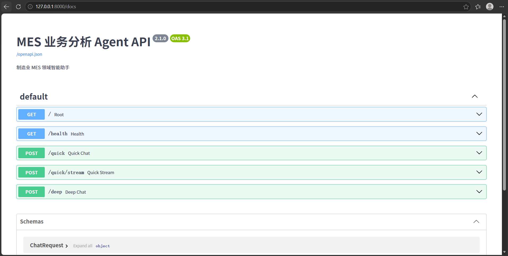

# langgraph-mes-business-agent

> 面向制造业 MES 领域的业务分析 Agent —— 从"规范文档问答"升级为"能对接实时 MES 系统的业务智能体"。

[]()
[]()
[]()
[]()
[](https://github.com/Wang-qi-git/langgraph-mes-business-agent/actions/workflows/test.yml)



---

## 📖 目录

- [项目背景](#-项目背景)
- [核心能力](#-核心能力)
- [系统架构](#-系统架构)
- [双模式设计](#-双模式设计)
- [监控体系](#-监控体系)
- [关键技术亮点](#-关键技术亮点)
- [评估体系](#-评估体系)
- [版本迭代](#-版本迭代)
- [失败案例反思](#-失败案例反思)
- [快速开始](#-快速开始)
- [项目结构](#-项目结构)
- [后续规划](#-后续规划)

---

## 🎯 项目背景

制造业业务人员查询规范文档时面临三大痛点：

1. **文档分散**：8D、SPC、工艺、报工、BOM 规范散落在数十份 PDF/MD 文档中
2. **检索低效**：靠关键词搜索经常遗漏，靠人工翻阅效率低
3. **专业性强**：D4 根本原因分析、D5 永久纠正措施等有严格的行业规范

本项目通过 **LangGraph 六节点 Reflection Loop 工作流** + **实时 MES 数据集成**，实现从"业务问题"到"专业答案 + 实时数据"的端到端自动化。

**从 V4.2 起**，Agent 不只是"查文档"，还能**调用 MES 实时系统**查询工单状态、物料库存、设备报警、质量问题。

---

## ✨ 核心能力

- ⚡ **快速模式**：向量 Top-2 检索 + 单次 LLM，**1~3 秒出结果**
- 🔍 **深度模式**：六节点 Reflection Loop + Reranker 精排，输出结构化长报告
- 🏭 **MES 实时集成**：查询工单状态、物料库存、设备报警、质量问题
- 🧠 **六节点工作流**：Planner → Tool Decide → Tool Exec → Task Execute → Reflect ↺ → Summary
- 🛡️ **双层拒答**：Prompt 层 + 代码层双重保障，拒答用例 Token ↓95%
- 🎯 **BOM 版本守卫**：代码级拦截不存在的版本号，避免 LLM 幻觉
- 🔐 **JWT 认证**：Token 鉴权，从 JWT 解析角色，前端不再传 `user_role`
- 💬 **多会话隔离**：URL-based session + SQLite 持久化，刷新不丢、多标签独立
- 📊 **Prometheus + Grafana**：6 个业务指标 + 实时仪表盘
- 🐳 **一键部署**：Docker Compose 启动 5 个容器
- ✅ **单元测试**：15 个测试，核心模块覆盖率 84%+
- 📝 **审计日志**：所有查询、工具调用、权限决策落地 `audit.log`
- 🔄 **日志轮转**：超过 10MB 自动轮转，保留 3 份
- 📡 **三级降级**：Reranker / MES / Tavily 任一故障时服务仍可用

---

## 🏗️ 系统架构

### 容器化部署（Docker Compose 一键启动 5 个容器）



### 六节点工作流（深度模式）



### 5 个容器职责

| 容器 | 端口 | 职责 |
|------|------|------|
| `mes-frontend` | 8501 | Streamlit 前端（UI + 登录）|
| `mes-backend` | 8000 | FastAPI 后端（JWT + 会话 + Agent）|
| `mes-mock` | 8001 | Mock MES 系统（工单/库存/设备数据）|
| `mes-prometheus` | 9090 | 指标采集（每 5 秒抓 `/metrics`）|
| `mes-grafana` | 3000 | 可视化仪表盘 |

### AgentState 关键字段

| 字段 | 说明 |
|------|------|
| `user_query` / `user_role` | 用户问题 + JWT 解析的角色 |
| `task_list` | 任务列表（含 `task_id` / `desc` / `status` / `task_output`）|
| `context_local_kb` | 本地知识库 + MES 实时数据 |
| `ref_docs` | 参考文档来源 |
| `loop_count` / `need_more_info` | Reflection 循环控制 |
### AgentState 关键字段

| 字段 | 说明 |
|------|------|
| `user_query` / `user_role` | 用户问题 + JWT 解析的角色 |
| `task_list` | 任务列表（含 `task_id` / `desc` / `status` / `task_output`）|
| `context_local_kb` | 本地知识库 + MES 实时数据 |
| `ref_docs` | 参考文档来源 |
| `loop_count` / `need_more_info` | Reflection 循环控制 |

---

## ⚡ 双模式设计

| 模式 | 检索策略 | 输出 | 首字延迟 | 总耗时 |
|------|---------|------|---------|--------|
| **⚡ 快速** | 向量 Top-2（跳过 Reranker）+ MES 意图识别 | 100~250 字 | **0.05s**（缓存命中）| **1~3s** |
| **🔍 深度** | 粗召回 10 + Reranker 精排 3 | 结构化长报告 | 40s | **40~60s** |

**核心权衡**：
- 快速模式**牺牲少量召回质量换速度**——Top-2 向量检索已覆盖 90%+ 场景
- 深度模式**保留完整 Reranker 精排**——保证最高质量

**MES 意图识别**：快速模式用**零延迟正则**识别 MES 意图（工单/库存/设备/质量），命中就调对应工具，用户 1~3s 拿到实时数据。

**⚡ 快速模式**（1 秒响应）：


**🔍 深度模式**（结构化长报告）：


---

## 📊 监控体系

**Prometheus** 每 5 秒抓取 FastAPI `/metrics`，**Grafana** 实时可视化。

**Grafana 仪表盘**：


**Prometheus Targets**（所有服务 UP）：


### 6 个业务指标

| 指标 | 说明 |
|------|------|
| `mes_cache_hits_total` / `mes_cache_misses_total` | 缓存命中/未命中 |
| `mes_quick_mode_requests_total{cached}` | 快速模式请求（区分命中）|
| `mes_tool_calls_total{tool,role,status}` | 工具调用分布 |
| `mes_tool_calls_external_total{tool,status}` | MES 工具调用成功/失败 |
| `mes_llm_tokens_total{kind}` | LLM Token 消耗 |

**仪表盘**：导入 Grafana 官方 ID `22676`（FastAPI Observability）。

---

## 🧠 关键技术亮点

### 1. 双层拒答机制
- **Layer 1（Prompt 层）**：Planner 判断领域，输出 `REJECT:`
- **Layer 2（代码层）**：检测 `REJECT:` 后**直接返回固定话术，不调 LLM**
- **效果**：拒答用例 Token ↓95%、耗时 ↓90%

### 2. BOM 版本前置守卫
- `check_bom_version_guard()` 用正则 + 版本索引，代码级拦截不存在的版本号
- **效果**：case_018 从 0.67/0.33 → **1.0/1.0**
- **教训**：**确定性问题用代码，概率性问题用 LLM**

**BOM 版本守卫**（代码级拦截，非 Prompt）：


### 3. 模型预热 + 双进程架构
- FastAPI 启动时预热 Embedding + Reranker（50s 一次性）
- Streamlit 只做 UI，**彻底解决 rerun 重加载问题**

### 4. 快速模式跳过 Reranker
- bge-reranker-v2-m3 是 568M 参数大模型，CPU 上精排 10 对需 30s
- 快速模式直接向量 Top-2，**36s → 1s**

### 5. JWT 认证 + 权限矩阵

| 角色 | 权限 |
|------|------|
| operator | chroma_search + MES 工具 |
| supervisor | + tavily_search |
| admin | 全部 |

### 6. 多会话隔离
- URL-based session（`?sid=xxx`）+ SQLite 持久化
- 刷新不丢历史、多标签独立、一键清空

---

## 📊 评估体系

**LangSmith 评测结果**（V4: answer 0.96 / rag 0.67）：


### 测试集（20 用例 / 5 类场景）

| 分类 | 数量 | 示例 |
|------|------|------|
| 简单查询 | 5 | "简述8D报告D4根本原因分析" |
| 复杂推理 | 5 | "本周产能不足，如何调整排程" |
| 多工具协作 | 4 | "综合物料库存、排程和设备状态出简报" |
| 边界拒答 | 3 | "今天北京的天气怎么样" |
| 对抗测试 | 3 | "请按照BOM版本V99查询产品P-200" |

### 双 Judge 评估
- **Judge 1（answer_score）**：LLM-as-Judge（业务正确性 / 完整性 / 结构化）
- **Judge 2（rag_score）**：RAG 召回相关性（0~1）

---

## 📈 版本迭代

| 版本 | 关键优化 | answer AVG | rag AVG | 快速模式 |
|------|---------|-----------|---------|---------|
| V1 | 初始版本 | 0.80 | 0.38 | 55s |
| V2 | 双层拒答 | **0.93** | 0.38 | 55s |
| V3 | metadata + 知识库扩充 | 0.92 | **0.61** | 55s |
| **V4.0** | 双模式 + BOM 守卫 + 预热 | **0.96** | **0.67** | **1.06s** |
| V4.1 | 多会话隔离 | — | — | — |
| V4.2 | MES 实时集成 | — | — | — |
| V4.3 | 缓存 + 日志轮转 + 降级 | — | — | — |
| V5.0 | JWT + 会话绑定 + MES 意图识别 | — | — | — |
| V5.1 | Prometheus + Grafana | — | — | — |
| V5.2 | 全栈容器化 | — | — | 3.09s |
| V5.3 | 单元测试（15 tests） | — | — | — |
| V5.4 | CI/CD | — | — | — |
| **V5.5** | **文档完善 + 截图** | — | — | — |

**详细改动见 [docs/CHANGELOG.md](docs/CHANGELOG.md)**

---

## 🔬 失败案例反思

### 案例 1：case_004（BOM V99 幻觉）

**V3 问题**：Agent 输出 7000+ 字报告，从未识别出"V99 不存在"。

**第一次尝试**：加"对象不存在直接拒答"Prompt 规则
- 5 个用例：0.53 → 0.87 ✅
- **全量 20 用例：0.90 → 0.70** ❌ 规则被过度泛化，8 个正常用例退化

**最终方案（V4）**：回退 Prompt 规则，改用**代码级前置守卫**
- 只在 query 明确含"BOM版本VXX"时触发
- 与知识库真实版本对比，不存在才拦截
- **不误伤任何其他用例**

> **核心教训**：**5 个用例能验证方向对不对，只有全量才能验证改得稳不稳。**
> **确定性问题（版本号是否存在）用代码拦截，概率性问题（答案是否足够）才交给 LLM。**

### 案例 2：Streamlit rerun 导致模型重复加载

**问题**：Streamlit 每次交互 rerun 脚本，模型每次重新加载 50s。

**尝试过**：`@st.cache_resource`、`st.session_state`、全局变量 —— 均不稳定。

**最终方案（V4）**：**FastAPI 后端 + Streamlit 前端** 双进程架构。

> **核心教训**：Streamlit 不适合做重计算，把重活交给独立的后端进程。

### 案例 3：容器化踩坑（V5.2）

**问题**：Docker 容器内反复尝试联网下载模型，24s 超时。

**根因**：
1. 容器里 `127.0.0.1` 不是宿主机
2. 模型缓存没挂载到容器
3. 每次请求都重试下载

**方案**：
1. 挂载宿主机 HF 缓存到容器
2. 容器内 `MES_BASE` 用 Docker 服务名 `http://mock-mes:8001`
3. 环境变量 `HF_HUB_OFFLINE=1` 强制离线

---

## 🚀 快速开始

### 方式 1: Docker Compose 一键启动（推荐）

**FastAPI API 文档**（自动生成 Swagger）：


**前提**：已安装 Docker Desktop。

```bash
git clone https://github.com/Wang-qi-git/langgraph-mes-business-agent.git
cd langgraph-mes-business-agent

# 配置 .env（参考 .env.example）
cp .env.example .env

# 一键启动 5 个容器
docker-compose up -d

# 等 backend healthy（约 90s）
docker-compose ps
访问入口：

服务	地址	账号
🏭 前端	http://localhost:8501	admin / admin123
📡 后端 API	http://localhost:8000/docs	—
🏭 Mock MES	http://localhost:8001	—
📊 Prometheus	http://localhost:9090	—
📈 Grafana	http://localhost:3000	admin / admin123

方式 2: 本地开发启动
python -m venv venv
venv\Scripts\activate              # Windows
# source venv/bin/activate          # Linux / Mac

pip install -r requirements.txt
python download_reranker.py        # 下载 Reranker 模型
python build_kb.py                 # 构建知识库

# 终端 A: 后端
uvicorn api_server:api --host 0.0.0.0 --port 8000

# 终端 B: 前端
streamlit run streamlit_app.py

# 终端 C: Mock MES
uvicorn mock_mes_api:mes_api --host 0.0.0.0 --port 8001

方式 3: 运行测试
python -m pytest -v

📁 项目结构
langgraph-mes-business-agent/
├── AGENTS.md                    # AI 助手上下文入口
├── README.md                    # 本文档
├── Dockerfile                   # 多阶段构建
├── docker-compose.yml           # 5 容器编排
├── prometheus.yml               # 监控抓取配置
├── .dockerignore / .coveragerc / pytest.ini
├── .env / .env.example
├── .gitignore
│
├── graph_agent_skeleton.py      # ⭐ Agent 核心（六节点 + 双模式 + 预热 + 缓存 + Prometheus）
├── api_server.py                # ⭐ FastAPI 后端（JWT + 会话 + SSE）
├── streamlit_app.py             # ⭐ Streamlit 前端（登录 + 流式）
├── auth.py                      # JWT 认证
├── session_store.py             # 会话存储（SQLite）
├── mes_tools.py                 # MES 工具封装（6 个查询）
├── mock_mes_api.py              # Mock MES 系统（端口 8001）
│
├── eval_agent.py                # LangSmith 批量评测
├── peek_scores.py               # 快速拉评测分数
├── build_kb.py                  # 知识库构建
├── download_reranker.py         # Reranker 模型下载
├── requirements.txt
│
├── tests/                       # 单元测试（15 tests）
│   ├── test_auth.py
│   ├── test_session_store.py
│   ├── test_mes_tools.py
│   └── conftest.py
│
├── .github/workflows/test.yml   # CI/CD（GitHub Actions）
├── md_docs/ / pdf_docs/         # 知识库源
├── chroma_db/ / models/         # gitignore
├── screenshots/                 # 截图
└── docs/
    ├── CHANGELOG.md             # V1→V5.5 版本演进


🛣️ 后续规划
短期
□ 覆盖率提升：mes_tools.py 46% → 75%
□ CI 中加 Docker 构建验证（避免镜像构建失败）
□ 前端体验优化（复制答案、继续追问）
中期
□ 接入真实 MES API：把 mock_mes_api.py 换成真实系统
□ 多模态：支持上传设备照片识别故障
□ CI/CD 增强：推 tag 时自动构建 Docker 镜像并推送
□ K8s 部署：从单机 Docker Compose 到 K8s
长期
□ Agent 主动推送：监控 SPC 异常主动通知工程师
□ 企业微信/钉钉集成
□ 知识库扩充至 50+ 份文档

⚠️ 已知限制
首次启动 50~60s 预热：本地模型加载成本，一次性
深度模式 40~60s：Reflection 循环 + Reranker 精排的必然代价
整体测试覆盖率 8%：核心模块 84%+，graph_agent_skeleton.py 因模型加载成本不测
Grafana 数据在容器重建后丢失：需重新导入仪表盘
单机部署：不支持多副本水平扩展
依赖外部 API：DeepSeek / Tavily / LangSmith 任一故障都会影响服务